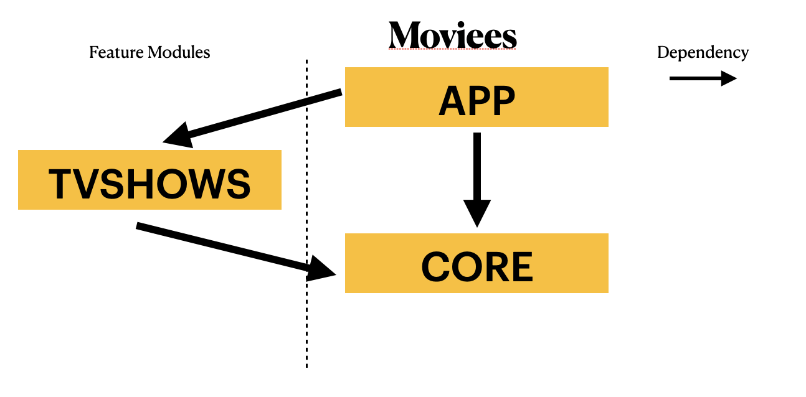
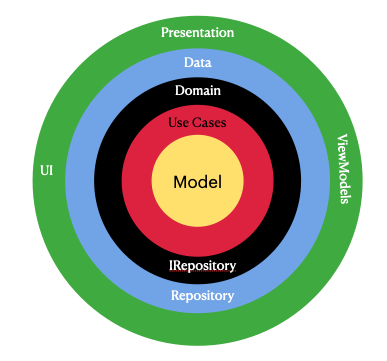

# Description
Moviee is an app that connects to The Movie Database API and gets Top Rated TV Shows and you can brows though similar
TV Shows.

# Dependencies

-   [Jetpack](https://developer.android.com/jetpack):
    -   [Android KTX](https://developer.android.com/kotlin/ktx.html) - Kotlin to Jetpack Apis
    -   [AndroidX](https://developer.android.com/jetpack/androidx) - AndroidX library
    -   [Lifecycle](https://developer.android.com/topic/libraries/architecture/lifecycle) - Helps you track the lifecycle state of your Android based components
    -   [Navigation](https://developer.android.com/guide/navigation/) - AndroidX Navigation library, very powerful.
    -   [ViewModel](https://developer.android.com/topic/libraries/architecture/viewmodel) - The ViewModel class allows data and state to survive configuration
        changes such as screen rotations.
-   [Coroutines](https://kotlinlang.org/docs/reference/coroutines-overview.html) - Managing background threads in a simple way
-   [Koin](https://insert-koin.io/) - Kotlin Dependency Injector library
-   [Ktor](https://ktor.io/docs/welcome.html) - Pure KotlinHTTP client.
-   [Glide](https://bumptech.github.io/glide/) -Library for image loading and caching.

#Architecture

## Module by feature
The modules created here are dependent on the features we want to implement and the features
are created by domain logic, in this case tv shows lists retrieved from TMDB api.
There is a core module holding the network dependencies and extensions the whole application is
going to use

 

## Clean Architecture
The feature modules are divided internally in clean architecture. Inside the feature modules exists:
- a domain package for business logic,
- data package for data retrieving,
- presentation package for everything UI related

 

## Dependency injection
This is a must-have architecture implementation to be able to have re-usability of code and make testing easier.
Im using Koin because it works with pure Kotlin and
It can be used to scale the project ti a Kotlin Multi Platform state which Im very interested.

## MVx
For the view I use a combination of MVVM and MVI. The ViewModel it's the one to hold the data
and the state of the view, so the view only listens to the ViewState changes and pass the data
to the ViewModel

## BuildSrc + Kotlin DSL
It helps the project by having all the dependencies in one place and allowing us to write gradle
extensions which is so nice to have. Also moving from .gradle to .gradle.kts is a must for all the
help Kotlin provides in builds
More info: (https://proandroiddev.com/better-dependencies-management-using-buildsrc-kotlin-dsl-eda31cdb81bf)

## Testing
For testing Im using Junit4, Mockk and the support test libraries for coroutines, android arch, koin and Junit Koin.
In this project you can see UseCases, Repository and ApiClient Testing

# Libraries

## Ktor
Ktor is my to-go library when working with KMM projects, it's very simple and it works in pure
Kotlin. It has a lot of options to work with multiple platforms and I love the modularization it
provides to play with the requests.
It also helps to easy Mock network responses while waiting for backend endpoints to be ready

## Kotlin serialization
Instead of GSON I started to use Kotlin serialization in order to be ready for KMP.

## Coroutines
In this project I use the Flow api from coroutines. It's super similar to the RX pattern but, simpler
and easier. Right now RX is on decline and people are moving to MVI architectures notifying states
instead of raw data to the UI (which is preferable) and Kotlin Flow allow us to do this smooth.
You can see that the Flow starts at the network edge and is collected in the viewModel where updates the
viewModel Live Data that is observed in the UI Controller.

## NDK to hide APIKEYS
Protect APIKEY using native C++ (SDK Tools NDK and CMake) from tools like APKPure and APKTool

#TODO´S

## Pagination
I would like to implement as update, AndroidX Pagination 3 to have a cleanear and more controlled pagination
and also integrate the loader and the retry in the recyclerview

## Similar TV Shows
Improve network search based on multiples genre Id´s

## DetailViewmodel
Migrate Args to state viewmodel

## Considerations
- Migrate to Jetpack Compose with Single Activity and zero fragments (If not, implement viewModel data binding to clean the UI Controller, in this project would be the MainActivity)
- In case to scale the app with XML View use Single Activity with multiple fragments and manage navigation with Jetpack Navigation which is very powerful)
- Improve XML Code using theme styles for TextView/Buttons
- Implement build variants to match company development lifecycle and also consider to add a Mock flavor in order to accelerate dev productivity while
  backend endpoints are not ready
- Implement Pinterest Klint (https://github.com/pinterest/ktlint)  to do static code analysis and also add a Git hook that automatically runs ktlint on every push to the remote in order
  to ensure we never push unformatted code.
- Understand core user feature to add metrics like "Time to Interact" in order to build an end user product oriented.

  
